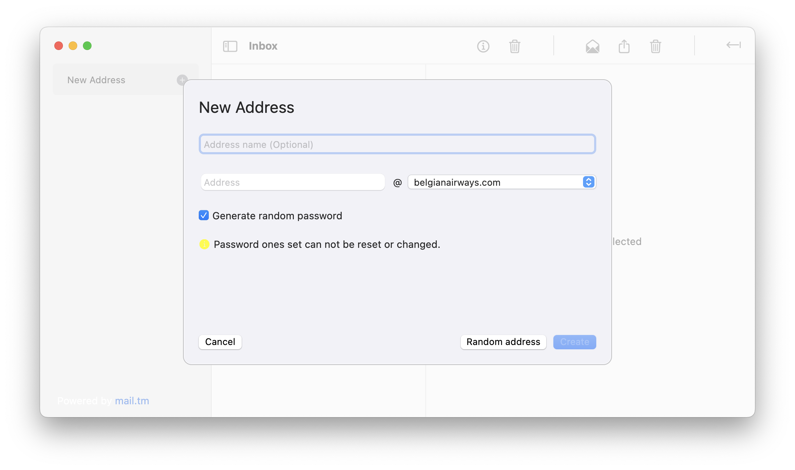
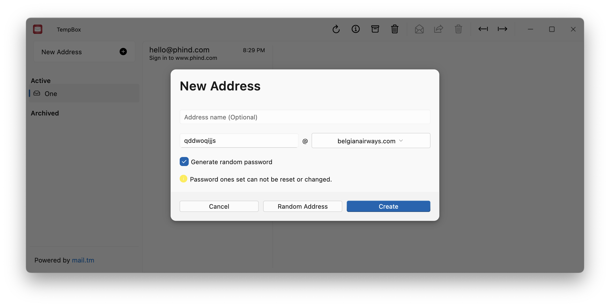

# TempBox

Instant disposable emails for Mac powered by [Mail.tm](https://mail.tm)

This project is heavely inspired by [TempBox](https://github.com/devwaseem/TempBox/tree/main) by [https://github.com/devwaseem](https://github.com/devwaseem)

## MacOS

<picture>
  <source srcset="screenshots/macos/light/MacOsApp.png" media="(prefers-color-scheme: light)">
  <source srcset="screenshots/macos/dark/MacOsApp.png" media="(prefers-color-scheme: dark)">
  
</picture>

<picture>
  <source srcset="screenshots/macos/light/MacOsAddressInfo.png" media="(prefers-color-scheme: light)">
  <source srcset="screenshots/macos/dark/MacOsAddressInfo.png" media="(prefers-color-scheme: dark)">
  
</picture>

<picture>
  <source srcset="screenshots/macos/light/MacOsNewAddress.png" media="(prefers-color-scheme: light)">
  <source srcset="screenshots/macos/dark/MacOsNewAddress.png" media="(prefers-color-scheme: dark)">
  
</picture>

## Windows

<picture>
  <source srcset="screenshots/windows/light/WindowsApp.png" media="(prefers-color-scheme: light)">
  <source srcset="screenshots/windows/dark/WindowsApp.png" media="(prefers-color-scheme: dark)">
  
</picture>

<picture>
  <source srcset="screenshots/windows/light/WindowsAddressInfo.png" media="(prefers-color-scheme: light)">
  <source srcset="screenshots/windows/dark/WindowsAddressInfo.png" media="(prefers-color-scheme: dark)">
  
</picture>

<picture>
  <source srcset="screenshots/windows/light/WindowsNewAddress.png" media="(prefers-color-scheme: light)">
  <source srcset="screenshots/windows/dark/WindowsNewAddress.png" media="(prefers-color-scheme: dark)">
  
</picture>

## iOS

  <picture>
    <source srcset="screenshots/ios/light/iOSApp.png" media="(prefers-color-scheme: light)">
    <source srcset="screenshots/ios/dark/iOSApp.png" media="(prefers-color-scheme: dark)">
    
  </picture>

  <picture>
    <source srcset="screenshots/ios/light/iOSImportExport.png" media="(prefers-color-scheme: light)">
    <source srcset="screenshots/ios/dark/iOSImportExport.png" media="(prefers-color-scheme: dark)">
    
  </picture>

  <picture>
    <source srcset="screenshots/ios/light/iOSAddAddress.png" media="(prefers-color-scheme: light)">
    <source srcset="screenshots/ios/dark/iOSAddAddress.png" media="(prefers-color-scheme: dark)">
    
  </picture>

  <picture>
    <source srcset="screenshots/ios/light/iOSAddressInfo.png" media="(prefers-color-scheme: light)">
    <source srcset="screenshots/ios/dark/iOSAddressInfo.png" media="(prefers-color-scheme: dark)">
    
  </picture>

## Android

  <picture>
    <source srcset="screenshots/android/light/AndroidApp.png" media="(prefers-color-scheme: light)">
    <source srcset="screenshots/android/dark/AndroidApp.png" media="(prefers-color-scheme: dark)">
    
  </picture>

  <picture>
    <source srcset="screenshots/android/light/AndroidImportExport.png" media="(prefers-color-scheme: light)">
    <source srcset="screenshots/android/dark/AndroidImportExport.png" media="(prefers-color-scheme: dark)">
    
  </picture>

  <picture>
    <source srcset="screenshots/android/light/AndroidAddAddress.png" media="(prefers-color-scheme: light)">
    <source srcset="screenshots/android/dark/AndroidAddAddress.png" media="(prefers-color-scheme: dark)">
    
  </picture>

  <picture>
    <source srcset="screenshots/android/light/AndroidAddressInfo.png" media="(prefers-color-scheme: light)">
    <source srcset="screenshots/android/dark/AndroidAddressInfo.png" media="(prefers-color-scheme: dark)">
    
  </picture>

## Features
- [x] Multi-Platform Support
- [x] Export and Import email addresses
- [x] Create multiple accounts
- [x] Download attachemnts

## Dependencies
| Dependancy | Use |
|------------|-----|
|[mailtm_client](https://pub.dev/packages/mailtm_client) | for mail.tm API |
|[flutter_bloc](https://pub.dev/packages/flutter_bloc) | for state management |
|[hydrated_bloc](https://pub.dev/packages/hydrated_bloc) | for data persistance |
|[path_provider](https://pub.dev/packages/path_provider) | |
|[flutter_slidable](https://pub.dev/packages/flutter_slidable) | |
|[macos_ui](https://pub.dev/packages/macos_ui) | for creating macos UI |
|[fluent_ui](https://pub.dev/packages/fluent_ui) | for creating windows UI |
|[window_manager](https://pub.dev/packages/window_manager) | for managing window size, title bar, window buttons etc. |
|[url_launcher](https://pub.dev/packages/url_launcher) | for handling URLs |
|[flutter_widget_from_html_core](https://pub.dev/packages/flutter_widget_from_html_core) | for rendering HTML |
|[system_theme](https://pub.dev/packages/system_theme) | to get system accent color |
|[file_picker](https://pub.dev/packages/file_picker) | for import feature |
|[pull_down_button](https://pub.dev/packages/pull_down_button) | for iOS style dropdown button |
|[cupertino_modal_sheet](https://pub.dev/packages/cupertino_modal_sheet) | for iOS style modal sheet |

## Contribute 🤝

If you want to contribute to this library, you're always welcome!
You can contribute by filing issues, bugs and PRs.

### Contributing guidelines:
- Open issue regarding proposed change.
- Repo owner will contact you there.
- If your proposed change is approved, Fork this repo and do changes.
- Open PR against latest `development` branch. Add nice description in PR.
- You're done!

## 📱 Contact
Connect with us on [Linkedin](https://www.linkedin.com/in/rishi-singh-b2226415b/)

## License

TempBox-Flutter is released under the MIT license. See [LICENSE](https://raw.githubusercontent.com/devwaseem/TempBox/main/LICENSE) for details.
